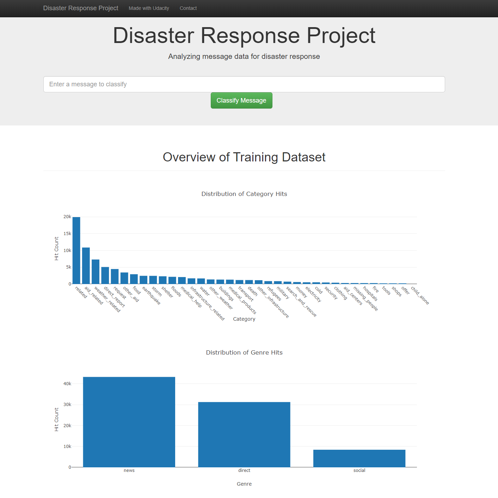
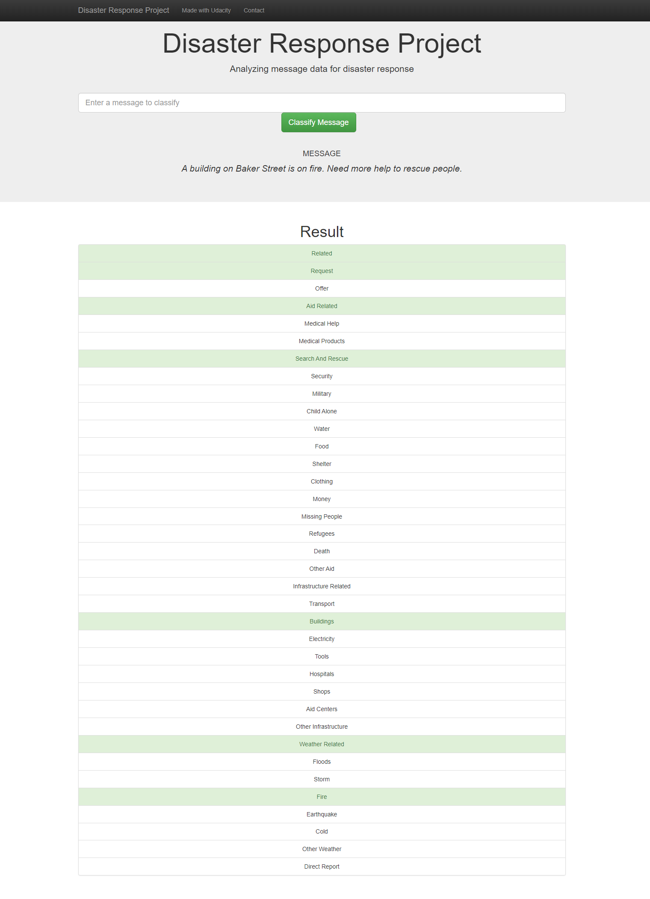

# Disaster Response Pipeline Project

## Table of Contents

1. [Motivation](#motivation)
2. [Project Summary](#summary)
3. [File Descriptions](#files)
4. [Installation](#installation)
5. [Instructions](#instructions)
6. [Result and Screenshots](#result_screenshot)

## Motivation 
In this project, we will build a model to classify messages that are sent during disasters. There are 36 pre-defined categories, and examples of these categories include Aid Related, Medical Help, Search And Rescue, etc. By classifying these messages, we can allow these messages to be sent to the appropriate disaster relief agency. This project will involve the building of a basic ETL and Machine Learning pipeline to facilitate the task. This is also a multi-label classification task, since a message can belong to one or more categories. We will be working with a data set provided by Figure Eight containing real messages that were sent during disaster events.

## Project Summary 

- An ETL pipeline was built to read data from two csv files, clean data, and save data into a SQLite database.
- A machine learning pipeline was developed to train a classifier to performs multi-output classification on the 36 categories in the dataset.
- A Flask app was created to show data visualization and classify the message that user enters on the web page.

## File Description 
Structure of the directory:

    [disaster_response]                          # Project's root directory
        ├── app     
        │   ├── run.py                           # Flask file that runs app
        │   └── templates   
        │       ├── go.html                      # Classification result page of web app
        │       └── master.html                  # Main page of web app    
        ├── data                   
        │   ├── disaster_categories.csv          # Dataset including all the categories  
        │   ├── disaster_messages.csv            # Dataset including all the messages
        │   ├── DisasterResponse.db              # Database containing clean data
        │   └── process_data.py                  # ETL pipeline script
        ├── models
        │   ├── classifier.pkl                   # Saved model
        │   ├── text_preprocess.py               # Custom function and class
        │   └── train_classifier.py              # ML pipeline script           
        └── README.md

There are three main folders in directory:
- **app**
     - **run.py**: Flask file to run the web application
     - **templates** contains html file for the web application
- **data**
     - **disaster_categories.csv**: dataset including all the categories
     - **disaster_messages.csv**: dataset including all the messages
     - **process_data.py**: ETL pipeline scripts to read, clean, and save data into a database
     - **DisasterResponse.db**: output of the ETL pipeline, i.e. SQLite database containing messages and categories data
- **models**
     - **train_classifier.py**: machine learning pipeline scripts to train and export a classifier
     - **text_preprocess.py**: contains customized text preprocess function and class
     - **classifier.pkl**: output of the machine learning pipeline, i.e. a trained classifier

## Installation 
This project requires Python 3.x and the following Python libraries:

- Machine Learning Libraries: NumPy, SciPy, Pandas, Sciki-Learn
- Natural Language Process Libraries: NLTK
- SQLlite Database Libraqries: SQLalchemy
- Web App and Data Visualization: Flask, Plotly

## Instructions 

1. Run the following commands in the project's root directory to set up your database and model.

    - To run ETL pipeline that cleans data and stores in database
        `python data/process_data.py data/disaster_messages.csv data/disaster_categories.csv data/DisasterResponse.db`
    - To run ML pipeline that trains classifier and saves
        `python models/train_classifier.py data/DisasterResponse.db models/classifier.pkl`

2. Run the following command in the app's directory to run your web app.
    `python run.py`

3. Go to http://0.0.0.0:3001/

## Result and Screenshots 
- This is the front veiw of the application.

- The following result is obtained, when we query in with: _"A building in Baker Street is on fire. Need more help to rescue people."_

